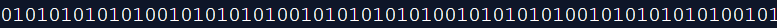
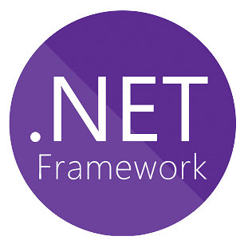

   <h1>Hi there </h1>
   <h3>🔵 My name is Yan 🔵</h3>
   <h3>🔵 Nice to meet you! 🔵</h3>
   <h3>🔵 Developer Analyst at NDD Tech 🔵</h3>
   <h3>🔵 Computer Science Student at IFSC Campus Lages 🔵</h3>
   <h3>🔵 Microservices and Azure enthusiast 🔵</h3>
   <h3>🔵 <a href="https://yanburigo.github.io/">Visit my Github Pages!</a> 🔵</h3>
   

--- 

   <h1>My Github Content</h1>
   

---

   <h1>Back-End Language and Frameworks</h1>
    
    
    
    
    
    
    
    

---

   <h1>Front-End Language and Frameworks</h1>
    
    
    
    
   
   
   
   
   
   
   
   
   
   

---

   <h1>Databases and Tools</h1>
   
   
   
   
   
   
   
   
   
   
   
   

---

